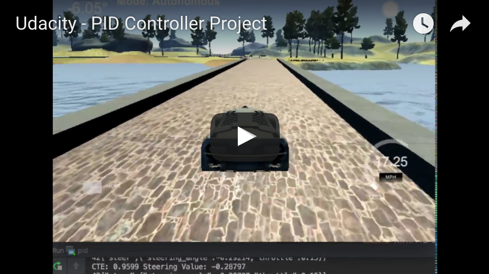

**Udacity Project - PID Controller**

**Video** - Vehicle driven autonomously by PID controller
_________________

**Reflections**
_________________

**Describe the effect each of the P, I, D components had in your implementation.**

The P in P Controller stands for *proportion*.  The P controller allows us to set the steering angle in proportion to the cross-track error (cte), which is the lateral distance between the vehicle and the reference trajectory (could be the curb or the center of the lane). 

The coefficient Kp would set the response strength of the controller.  The higher the Kp, the stronger the adjustment wrt the cte error.  A high Kp could cause the system to oscillate but a low Kp would compensate less/slower.  
 
The D in PD controller stands for *derivative*. In the PD controller the steering angle is not only related to the cte, but it also depends on the temporal derivative of the cte.  This is taken into consideration that, with the adjustment over time, error should become smaller and we should reduce the effect of P over time.

The coefficient Kd would set the response proportionately to the differential cte.  

The I in PID controller stands for *integral* and it is introduced to counteract systematic bias, such as when the wheels that are incorrectly aligned. This error could contribute a large amount sustained over time.  Therefore, controller needs to overcome it by recording the integral (or sum) of all of the cte observed over time.

_________________
**Describe how the final hyperparameters were chosen.
**

The hyperparameters were selected via manual tuning.  Going through this process is a great way to develop insights on how a PID controller would react to conditions on different types of roads.

Since we are running the vehicle in a simulation, I assume that very little system bias exists in the virtual car.  Therefore, Ki was assigned to 0 (I also tried some very small number such as 1E-05 or 1E-06 and I didn't notice much of a difference.)  Therefore our controller is essentially a PD controller.  I would imagine that in the real/physical world, this parameter needs to be set to something non-zero depending on how big the system bias is.

Kp affects how quickly the steering converges.  If Kp is larger, convergence happens quickly and we get to the equalibrium sooner.  However, the swerving could be drastic and unpleasant for the passenger.  

Kd affects a very important compensation here because without it the car could quickly overshoot and go over the curb and down into the water.

We have discovered that a large value of Kp is mostly fine for travel in relatively straight line as the car compensates the error quickly and drive the rest of the trip in the middle of the lane.  While this is fine for straight line driving, it is not for the section of the road that is curvy.  Tuning the parameters for the curvature section of the road is more challenging.  As different curvature can substain different response time. To quickly adjust the errors, we are often at the expense of comfort of the passenger.

To take into consideration of having a smoother ride, here are the final hyperparameter values:

Kp = 0.5
Ki = 0
Kd = 2.5

The throttle_value is between 0.15 to 0.3 based on the steering angle.

_________________

